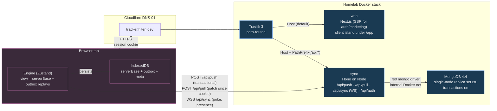

# Slipstream

[](https://github.com/hitenpatel/slipstream/actions/workflows/ci.yml)
[](./LICENSE)
[](https://codecov.io/gh/hitenpatel/slipstream)
[](#testing)
[](https://tracker.hiten.dev)

> **Local-first sync, built from scratch.**
>
> Optimistic mutations on the client, a server-authoritative mutation log on the server, and a
> single MongoDB transaction with a global counter that serialises concurrent writes into one
> total order. The issue tracker on top is the demo — the engine is the work.

**Live demo:** [tracker.hiten.dev](https://tracker.hiten.dev) · sign up, open two browsers,
watch them converge.

**Read it as a system design:**
[`docs/ARCHITECTURE.md`](./docs/ARCHITECTURE.md) (backend + protocol + ADRs) ·
[`docs/FRONTEND.md`](./docs/FRONTEND.md) (frontend, six Mermaid diagrams in §0).

---

## What it is

Slipstream is a local-first collaborative issue tracker. Every user action takes effect locally
before the server is consulted, the UI is computed from a materialised view of `serverBase +
unconfirmedOutbox`, and the engine reconciles deterministically against an authoritative log on
the server. The tracker surface — board, list, command palette, issue detail, presence, comments,
labels — exists to demonstrate the engine works under real-world load.

The model is the one [Replicache](https://replicache.dev/) and [Linear](https://linear.app/)
use. **The point of this repo is that the engine is designed and built here, not bought in.**

## What it does

When you open the live demo:

- Signup mints a workspace + a default project through the same push path any other mutation
  takes. Your first pull returns everything you own.
- The **list view** is windowed-virtualised, sorted by fractional index, and filterable by
  status / label / search via URL params (`?status=…&label=…&q=…`). Filters are shareable links.
- The **board view** has five status columns with keyboard-operable drag-and-drop. Picking up a
  card and moving it across columns is a single field change with no cascade (fractional index
  + status).
- Switching List ↔ Board preserves scroll, focus, filters, and the open detail dialog because
  both views stay mounted via `<KeepAlive>` (the manual equivalent of React 19.2's
  experimental `<Activity mode="hidden">`).
- The **issue detail dialog** is URL-driven (`?issue=ID`), so a teammate can paste a link and
  land inside the same overlay with the list/board still visible behind.
- A **command palette** (`Cmd/Ctrl-K`) is a proper WAI-ARIA combobox: type "polish", `Enter`,
  open the issue; type "in progress polish", `Enter`, set the status.
- **Presence** shows you which workspace peers are looking at what — avatars on each project
  row, then in the issue detail header when someone opens the same overlay.
- Every state change posts a polite `aria-live` announcement: "Syncing changes…", "All changes
  synced. Version 42.", "You are offline. Changes will be saved locally and synced when you
  reconnect." Optimistic rows render a "pending" pill until the server stamps a real version.

## Architecture at a glance



For state layers, mutation lifecycle, auth flow, and presence diagrams, see
[`docs/FRONTEND.md §0`](./docs/FRONTEND.md) (six Mermaid diagrams).

## Tech stack — and why

Each choice was made against a defensible alternative. The "why" column is what would change if
the alternative had won.

### Language + types

| Choice | Why | Alternative considered |
| --- | --- | --- |
| **TypeScript (strict, `noUncheckedIndexedAccess`)** | One language across front-end, back-end, and the shared `packages/protocol`. Mutator definitions, entity shapes, and protocol messages are written once and imported on both sides — the compiler enforces that the server can never drift from the client's idea of a mutation. | JS + JSDoc would work but lose ergonomics around discriminated unions and generic mutator typing. |
| **Zod** | Runtime validation that derives the static type, used at every protocol boundary (`/api/push`, `/api/pull`, `/api/auth/*`, the WS `focus` message). Server inputs are validated; the type system trusts what zod produced. | Hand-written validators would duplicate the source of truth; AJV/io-ts are also valid but heavier on the bundle. |

### Frontend

| Choice | Why | Alternative considered |
| --- | --- | --- |
| **React 19** | `useEffectEvent` for reading-latest state in WS handlers without effect resubscription; future drop-in `<Activity>` for the view-switching pattern; first-class transitions for the optimistic UI. | React 18 would have shipped the engine but the brief is React 19. Solid/Preact would change too much else. |
| **Next.js 15 (App Router)** | RSC for the marketing landing + auth pages (no client JS needed for those, fast TTFB); the authenticated app is a single client island that boots the sync runtime. Server Components keep the auth gate honest by reading the cookie server-side. | A pure SPA would force client-side auth checks and lose the SSR auth-gate redirect. Remix is comparable; chose Next because the App Router boundary maps cleanly to "RSC for the gate, client for the engine". |
| **Zustand (vanilla store + `useStore`)** | The Engine creates a vanilla Zustand store outside React, so it can be the single source of truth across many components and survive route changes; components subscribe with selectors. No provider drilling, no React-Context render storms on every state update. | Redux Toolkit would add boilerplate and a reducer model that doesn't match a materialised view. Jotai would scatter state across atoms and lose the "one store" invariant. Bare React state ties the engine's lifetime to component mount. |
| **IndexedDB via `idb`** | The outbox and `serverBase` need to survive reload and offline. IDB is the only browser storage that gives durable async access to structured data at the size we need. The `idb` wrapper adds typed `openDB` and removes the callback-driven IDBRequest model. | `localStorage` is synchronous and too small. `localforage` is a fine alternative; `idb` is thinner. |
| **`@dnd-kit/core` + `@dnd-kit/sortable`** | Keyboard sensor out of the box — Space/Arrow/Space/Esc with built-in `aria-live` announcement plumbing. Accessibility was a hard requirement, not a finishing pass. | `react-beautiful-dnd` is feature-frozen and doesn't have first-class keyboard semantics. Building DnD ourselves would be a huge a11y rabbit hole. |
| **`@tanstack/react-virtual`** | Headless, no opinion on row markup. The list view is virtualised but the same component still emits the same `<button>` rows the unvirtualised version did — the row's a11y contract didn't change. | `react-window` is older but solid. Tanstack matches the rest of the headless-data story (Query, DB). |
| **Design tokens (CSS custom properties) + CSS Modules + cascade layers** | Tokens flow into one file (`@slipstream/ui/tokens.css`) so dark mode is one `prefers-color-scheme` rule and `forced-colors` mode is one mapping to system colours. CSS Modules scope per-component, cascade layers (`@layer reset, tokens, base, components, utilities`) make precedence explicit. | Tailwind v4 would be a one-line swap behind tokens; chose modules to keep the styling story closer to the design-system pattern the brief calls for. Styled-components would put style in JS bundles and break SSR streaming. |

### Backend

| Choice | Why | Alternative considered |
| --- | --- | --- |
| **Hono on Node** | Tiny router (~12 kB), web-standard `Request`/`Response`, easy to mount on either Node or edge runtimes. The sync server's surface is small enough that Hono's middleware story is a net plus, not a tax. | Express adds CommonJS, middleware-mutating `req`/`res`, and slower types. Fastify is excellent but its plugin model is heavier than what /api/push needs. |
| **`@hono/node-server`** | Returns the raw Node `http.Server`, which is what `ws.WebSocketServer.handleUpgrade(...)` needs. Hono apps that wanted WS support on serverless would have to fragment; this stays one process. | Hono's built-in Bun adapter would require switching the runtime. |
| **`ws` (vs Socket.IO)** | One protocol, no fallback ladder, easy to reason about. The WS payload is plain JSON; no Engine.IO/Socket.IO framing overhead. The auth-on-upgrade pattern (ADR-005) is a few lines because we own the upgrade event. | Socket.IO bundles fallbacks for browsers that aren't a concern in 2026 and would add ~30 kB to the client. |
| **`mongodb` (raw driver, no Mongoose)** | The push path needs an explicit `withTransaction(async session => …)` block that wraps a `counters.findOneAndUpdate($inc:{seq:1})` and several entity upserts. The raw driver exposes sessions and write concerns directly; Mongoose hides them behind schemas we don't need. | Mongoose would add a schema layer that duplicates the Zod entity schemas. Prisma doesn't support Mongo transactions across collections in the way the engine requires. |
| **MongoDB (4.4, single-node replica set)** | Multi-document transactions, a single-collection pull query (`entities.find({ version: { $gt: cookie } })`), document-store modelling that maps cleanly to the Zod discriminated union. The single-node replset is the minimum that supports transactions; pinned to 4.4 because the homelab CPU lacks AVX. | PostgreSQL with a `jsonb` column would work but means every entity write is row-level locking against a big table. DynamoDB doesn't have cross-document transactions in a portable way. |
| **`@node-rs/argon2`** | Argon2 is the current best-practice password hash. The `@node-rs` build uses Rust-NAPI bindings that benchmark ~5–10× faster than pure-JS Argon2 implementations, with builds for arm64 (homelab) and amd64 (CI). | `bcrypt` is fine but Argon2 is the modern default. `argon2` (the pure-JS package) is slower on the arm64 host. |

### Sync protocol building blocks

| Choice | Why | Alternative considered |
| --- | --- | --- |
| **uuidv7 (hand-rolled, ~80 lines)** | Client-mintable so entities can be created offline; time-sortable so the natural sort matches creation order; in-ms monotonic so two ids from the same tick still sort in creation order. | uuidv4 sorts by chance. uuidv1 leaks MAC addresses. A library would add a dependency for ~80 lines. |
| **Fractional indexing for `position`** | Reordering an issue is a single field write — pick a string key between its new neighbours. No cascade, no rebalancing, conflict-friendly because moving issue A doesn't touch the rest of the column. | Integer positions need to renumber every neighbour on insert. Linked lists require multiple field writes per move. |
| **Single global counter (`counters.global`, `$inc`-ed inside the push tx)** | One Mongo write produces a strict total order across every workspace, every client, every concurrent push. Two pushes both `$inc` the same document, Mongo detects the write conflict, `withTransaction` retries — the loser is serialised after the winner. | A per-workspace counter would scale better but break the global cookie. A timestamp-based ordering wouldn't survive clock skew. |
| **Same mutator code, two execution sites** | Mutators in `packages/protocol/src/mutators.ts` take a `Tx` interface (`get`/`put`/`del`). The client implements `Tx` against an in-memory `MemoryView`; the server implements it against a Mongo session. The same function runs on both sides, so they can never drift. | Separate client/server logic guarantees they will drift; the brief specifically calls this out. |

### Local-first primitives

| Choice | Why | Alternative considered |
| --- | --- | --- |
| **Materialised view = `serverBase + unconfirmedOutbox`** | The view the UI subscribes to is computed, not stored. No second cache that can disagree with the engine's idea of state. Rollback is automatic — a rejected mutation simply isn't replayed. | A separate optimistic store would need explicit rollback logic for every failure mode. |
| **`POST /api/pull` over HTTPS, not on the socket** | The socket carries only signals (`poke`, `presence`, `hello`); patches always travel over HTTPS. A dropped socket loses zero data; the protocol is debuggable with `curl` and a cookie. | Streaming patches over the socket would tangle the recovery story — what if a client missed a frame? Pulling on HTTPS is idempotent. |
| **Cookie sessions (Argon2 + 30-day TTL + Mongo TTL index)** | One auth story across the HTTPS endpoints and the WebSocket. The WS upgrade inherits the cookie because it's same-origin (`SameSite=Lax`); the server validates it before `handleUpgrade`. | JWT in localStorage would mean explicit token-on-first-message for the WS, which the brief explicitly warns against (XSS exfiltration). |

### Infra

| Choice | Why | Alternative considered |
| --- | --- | --- |
| **Traefik 3 (Docker provider)** | Containers declare routes via labels in `docker-compose.yml`; Traefik discovers them and routes by path. Automatic Let's Encrypt via Cloudflare DNS-01 so the cert can be issued for a host that isn't HTTP-01 reachable. WebSocket upgrades are transparent — no extra config. | Caddy is comparable. Nginx requires a manual config file per service. |
| **Cloudflare DNS-01 challenge** | Wildcard certs across `hiten.dev` and `hiten-patel.co.uk` are issued by Cloudflare API; the homelab box doesn't need to be reachable on port 80 from outside. | HTTP-01 would require the box to be internet-reachable for cert issuance, which complicates the deploy story behind a tunnel. |
| **Docker Compose + a single host** | Three long-lived containers (`web`, `sync`, `db`). The brief is honest about scope — multi-region is explicitly out — and Compose is the smallest thing that builds the stack reproducibly. | Kubernetes for three containers on one box is theatre. Bare systemd loses the dev-prod parity. |
| **GitHub Actions, deploy via Tailscale OAuth** | Hosted runner joins the tailnet to SSH the box. Self-hosted runners can't be attached to a public repo because forks can run arbitrary code on them — this side-steps the issue entirely. | A webhook receiver on the box would work but adds an inbound port. |

### Tooling + tests

| Choice | Why | Alternative considered |
| --- | --- | --- |
| **pnpm workspaces + Turborepo** | The shared `packages/protocol` is consumed by both apps and another package; pnpm's `workspace:*` keeps it linked without publishing. Turbo caches per-task so a docs-only PR rebuilds nothing. | npm workspaces is functional but slower; Yarn Berry is fine but pnpm is the de facto monorepo standard. |
| **Vitest** | Vite-native, ESM-first, parallel by default, faster than Jest on cold starts. The same config powers `protocol`, `client`, `sync`, and `web` test suites. | Jest works but its CJS-first stance fights ESM-heavy code; Mocha lacks parallelism. |
| **`mongodb-memory-server`** | The push handler's transactional logic must run against a real Mongo replica set, not a mock. `mongodb-memory-server` boots an actual mongod as a single-node replset inside the test process so transactions work in CI without a service container. | Mocking Mongo would let bugs through that only show in real driver behaviour. A docker service container in CI would add ~20s of startup per job. |
| **`@testing-library/react` + `happy-dom`** | The palette's WAI-ARIA combobox markup is rendered and validated against axe-core. happy-dom is ~3× faster than jsdom for the assertions we need. | jsdom is the more complete DOM but slower; we don't need every spec edge case for component tests. |
| **`axe-core`** | Asserts zero WCAG 2A / 2AA / best-practice violations on the palette's markup in CI. A second test contract-checks that `aria-activedescendant` always points at a real option id, so the keyboard nav can't silently break. | Manual a11y reviews don't catch regressions; eslint-plugin-jsx-a11y catches code patterns but not the rendered DOM. |
| **`eslint-plugin-jsx-a11y` (`recommended` + stricter overrides)** | Catches static-element click handlers, autoFocus, anchor misuse before they ship. Plugged into `next-lint` so it runs in CI. | Skipping it would let the patterns it catches leak in unnoticed. |
| **Mermaid for diagrams** | Render natively on GitHub. Version-controlled with the code, reviewable in a PR diff, no external service. The frontend design has six diagrams (state layers, route tree, mutation lifecycle, auth flow, container view, presence) all inline. | A Miro board can't be version-controlled or PR-reviewed. Excalidraw is fine for free-form sketches but Mermaid is the natural fit for the diagrams we need. |

## Design choices that pay off

These are the invariants the rest of the system rides on. They're worth understanding even if
you only read the README.

- **The materialised view is computed, not stored.** Every render reads
  `serverBase + outbox replays`. There is no second cache that can drift. Rollback is automatic:
  a rejected mutation simply isn't replayed on the next recompute.
- **Exactly two writers in the engine.** `engine.mutate` (append to outbox) and
  `engine.applyPatch` (advance serverBase). Nothing else mutates state, anywhere. Components
  read; effects don't sneak in side-mutations.
- **One MongoDB transaction wraps the entire push path.** Counter `$inc`, all mutator writes,
  and the `clients.lastMutationID` update are atomic. If any mutator throws, Mongo rolls back
  every write the batch made — no partially-applied pushes.
- **One source of truth for mutator code.** The same function runs on the client (in-memory `Tx`)
  and on the server (Mongo session `Tx`). They can't drift because they're the same code.
- **Total order from a single Mongo write.** `counters.findOneAndUpdate($inc:{seq:1})` inside
  the transaction. Two concurrent pushes conflict on the same document; Mongo's transaction
  retry serialises them. Strict ordering, no clock synchronisation, no Lamport stamps.
- **The socket is the signal plane, HTTPS is the data plane.** Patches travel on HTTPS; the
  socket carries only `hello`, `poke`, `presence`. A dropped socket loses zero data because
  reconnection just triggers another HTTPS pull.
- **The WebSocket upgrade is auth-gated against the same cookie.** No "send a token in the
  first frame" dance, no separate auth story for the socket — same cookie session as the HTTP
  endpoints, refused with `HTTP 401` if invalid.
- **Filters and the open dialog live in the URL.** `?status=…&label=…&q=…&issue=ID` is the
  canonical representation. Teammates can paste a link. The back button works.
- **Accessibility is a design property, not a phase.** Keyboard everywhere, WAI-ARIA combobox
  for the palette, `aria-live` announcements for DnD steps and the sync lifecycle, axe-core
  asserting zero violations in CI, `eslint-plugin-jsx-a11y` catching patterns at lint time,
  forced-colors mappings to system colours so high-contrast users see the same status pills.

## Repository layout

```
slipstream/
  apps/
    web/                 # Next.js (App Router) — RSC auth/marketing + client island under /app
    sync/                # Hono on Node — mutation log, reconciliation, auth, presence broker
  packages/
    protocol/            # entities, mutators, Zod schemas, protocol messages (shared FE+BE)
    client/              # sync runtime: store, outbox, transport, WS+presence channel, rebase loop
    ui/                  # design tokens + accessible primitives
  infra/
    Dockerfile.web
    Dockerfile.sync
    docker-compose.yml   # web + sync + Mongo (single-node replica set)
  .github/workflows/
    ci.yml               # typecheck · lint · test · build · docker · deploy
  docs/
    ARCHITECTURE.md      # backend + protocol + ADR-001..006
    FRONTEND.md          # route tree, state model, accessibility plan, 6 Mermaid diagrams
  CLAUDE.md              # how the autonomous agent should treat this repo
```

## Testing

60 tests across the stack, 20/20 turbo tasks per CI run. CI runs each
workspace's suite with `--coverage` and uploads one lcov-per-workspace to
Codecov, so the per-package contribution is visible separately under the
flags `protocol`, `client`, `sync`, `web`.

| Package | Tests | Coverage (Vitest v8) | Highlights |
| --- | --- | --- | --- |
| `packages/protocol` | 13 | ~73% | uuidv7 monotonicity; fractional indexing bounds + 200-round insertion; mutator semantics + idempotency |
| `apps/sync` | 20 | ~86% | push: monotonic versions, idempotent replay, gap break + resume, rollback on throw, total order under concurrency; pull: empty-when-current, soft-delete emission; socket: auth gate, hello, register/deregister, broker fan-out, presence broadcast |
| `packages/client` | 16 | ~73% | optimistic apply, rebase to confirmed version, offline survival; 2- and 3-client randomised-interleaving convergence; poke channel reconnect backoff curve; presence dispatch + republish-on-reconnect |
| `apps/web` | 11 | 100%¹ | palette substring scoring (prefix vs mid-string ranking, multi-token AND, command tie-break); palette combobox markup axe-clean; KeepAlive contract (both children mounted, inactive frame inert + aria-hidden) |

¹ The web percentage is computed over the files explicitly under unit test
(`palette-search.ts`, `keep-alive.tsx`). The rest of the Next.js UI is covered
end-to-end by the live demo and the (planned) Playwright keyboard-only flows
in M7 — measuring it as unit-coverage would be misleading.

Run locally with `pnpm turbo run typecheck lint test build`, or
`pnpm turbo run test:coverage` to produce lcov reports under
`<workspace>/coverage/`.

## Running it

```bash
pnpm install
pnpm dev               # web on :3000, sync on :8787 — needs Mongo (see below)
```

For the full stack with Mongo:

```bash
cp .env.example .env
# fill in SESSION_SECRET; openssl rand -hex 32 is fine
docker compose -f infra/docker-compose.yml up --build
```

## Deployment

The production stack runs on a homelab box behind an existing Traefik instance, joined to the
`home-server_frontend` network. Certificates are issued via the Cloudflare DNS-01 challenge already
configured on that Traefik, so `tracker.hiten.dev` gets a real cert without any HTTP-01
reachability work. Mongo is `mongo:4.4` (the last AVX-free build — the homelab CPU lacks AVX) as a
single-node replica set so multi-document transactions work.

Deploy is GitHub Actions on `main` only. Fork PRs can't reach the box because the deploy step is
gated on `refs/heads/main`. The hosted runner joins the tailnet over Tailscale OAuth and SSHes to
the box.

## Reading order

- 30 seconds: this README's "What it is" + "Design choices that pay off".
- 5 minutes: [`docs/ARCHITECTURE.md`](./docs/ARCHITECTURE.md), particularly §3 (the engine) and
  §9 (the six ADRs).
- 15 minutes: [`docs/FRONTEND.md`](./docs/FRONTEND.md) §0 (six Mermaid diagrams).

## License

MIT — see [`LICENSE`](./LICENSE).
