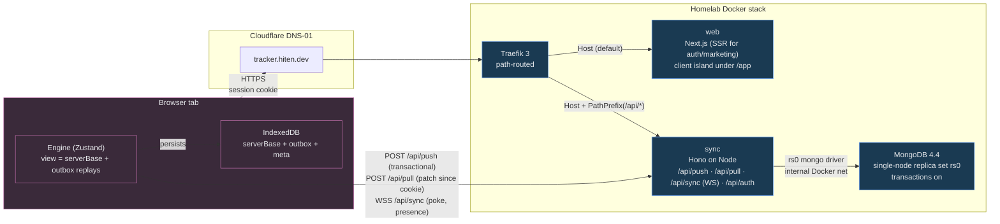

# Slipstream

[](https://github.com/hitenpatel/slipstream/actions/workflows/ci.yml)
[](./LICENSE)
[](#testing)
[](https://tracker.hiten.dev)

> **Local-first sync, built from scratch.**
>
> Optimistic mutations on the client. A server-authoritative mutation log on the server. A single
> MongoDB transaction with a global counter that serialises concurrent writes into one total order.
> Deterministic rebasing on every pull. The issue tracker on top is the demo — the engine is the
> work.

**Live:** [tracker.hiten.dev](https://tracker.hiten.dev) · sign up, open two tabs, watch them
converge.

**Read it as a system design**:
[`docs/ARCHITECTURE.md`](./docs/ARCHITECTURE.md) (backend + protocol + ADRs) ·
[`docs/FRONTEND.md`](./docs/FRONTEND.md) (frontend, with five Mermaid diagrams in §0).

---

## The thirty-second pitch

This is a local-first collaborative issue tracker on a hand-built sync engine. Named mutations on
the client are optimistically applied against a materialised view backed by an IndexedDB outbox,
then pushed to a Node sync server that runs the **same mutator code** authoritatively inside a
MongoDB multi-document transaction. A single `counters` document is `$inc`-ed inside that
transaction to mint a global version, which gives every change a total order.

Other clients are poked over WebSocket, pull a patch since their last-seen version, drop confirmed
mutations from their outbox, and rebase the rest on top. Conflicts resolve as
last-write-in-server-order-wins at mutation granularity. Every client converges. Rollback is free
because rejected mutations simply leave the outbox.

The model is the one Replicache and Linear use. The point of this repo is that the engine is
**designed and built here, not bought in**.

## Why it exists

- **A non-vendor implementation of a hard, real distributed-systems pattern**, owned end-to-end.
  No `replicache.js`, no Yjs, no managed CRDT service — the convergence proof is in
  [`packages/client/src/engine.test.ts`](./packages/client/src/engine.test.ts).
- **A genuine MongoDB use case** — multi-document transactions, an idempotent push log, a global
  counter `$inc` as the source of total order — rather than CRUD over a document store.
- **Accessibility treated as a property of the design**, not a finishing pass. The
  optimistic-to-confirmed sync lifecycle is *perceivable* to screen-reader users; the board's
  drag-and-drop is fully keyboard-operable with `aria-live` step announcements; the command palette
  is a WAI-ARIA combobox by the book.
- **A portfolio piece you can read.** The PR history is the milestone history — each milestone is
  one reviewable PR with prose, code, and tests in one place.

## Architecture at a glance



Full diagrams of state layers, mutation lifecycle, auth flow, and presence are in
[`docs/FRONTEND.md §0`](./docs/FRONTEND.md). They render natively in GitHub.

## What's running on the live demo

`tracker.hiten.dev` runs the same containers this repo builds. After signing up you get:

- An IndexedDB-backed Zustand store materialising `serverBase + unconfirmedOutbox` per render.
- **List view** with virtualised rendering (`@tanstack/react-virtual`), URL-driven filters
  (`?status=…&label=…&q=…`), and a command palette (`Cmd/Ctrl-K`) with substring scoring.
- **Board view** with keyboard-operable drag-and-drop (`dnd-kit` keyboard sensor + `aria-live`
  step announcements). Switching List ↔ Board preserves scroll, focus, filters, and the open
  dialog because both views are kept mounted via `<KeepAlive>` (the manual equivalent of React
  19.2's experimental `<Activity>`).
- **Issue detail overlay** at `?issue=ID` (shareable URL, `role=dialog`, `aria-modal`, Escape to
  close, scrim button as the click-outside affordance) with editable title/description/priority/
  status, label toggle chips with inline creation, comments thread.
- **Sync status announcer** — a polite live region that posts on state transition only
  (connecting, syncing, all-synced v42, offline), separate from the visual badge.
- **Presence** — workspace-scoped avatars on each project row and in the issue detail header.
  Multi-tab users appear once with the focus from their most-recently-active tab. WebSocket
  upgrades are auth-gated; anonymous upgrades get HTTP 401.

## Repository layout

```
slipstream/
  apps/
    web/                 # Next.js (App Router) — RSC auth/marketing + client island under /app
    sync/                # Hono on Node — mutation log, reconciliation, auth, presence broker
  packages/
    protocol/            # entities, mutators, Zod schemas, protocol messages (shared FE+BE)
    client/              # sync runtime: store, outbox, transport, WS+presence channel, rebase loop
    ui/                  # design tokens + accessible primitives
  infra/
    Dockerfile.web
    Dockerfile.sync
    docker-compose.yml   # web + sync + Mongo (single-node replica set)
  .github/workflows/
    ci.yml               # typecheck · lint · test · build · docker · deploy
  docs/
    ARCHITECTURE.md      # backend + protocol + ADR-001..006
    FRONTEND.md          # route tree, state model, accessibility plan, 6 Mermaid diagrams
  README.md              # this file
  CLAUDE.md              # how the autonomous agent should treat this repo
```

## Milestones

Each milestone is one PR. The full PR history is the design history.

| Milestone | Slice | Done when | PR |
| --- | --- | --- | --- |
| **M0** | scaffold + CI + hello-world deploy | green pipeline, hello over HTTPS, sync healthcheck | initial |
| **M1** | entities + mutators + `/api/push`+`/api/pull` | idempotent in-order push inside one transaction; pull patch by cookie | [#1](https://github.com/hitenpatel/slipstream/pull/1) |
| **M2** | client runtime: outbox, optimistic apply, rebase loop | 2-client and 3-client randomised interleavings converge to identical state | [#2](https://github.com/hitenpatel/slipstream/pull/2) |
| **M3** | WebSocket transport, poke-and-pull, reconnect | edit in one tab appears in another within a tick; dropped sockets recover without lost mutations | [#3](https://github.com/hitenpatel/slipstream/pull/3) |
| **M4a** | auth, app gate, EngineProvider | signup → bootstrapped workspace; `/app` gate; engine boots on mount | [#4](https://github.com/hitenpatel/slipstream/pull/4) |
| **design** | written frontend system design + Mermaid diagrams | 5 diagrams + state model + a11y plan reviewable in a PR | [#6](https://github.com/hitenpatel/slipstream/pull/6) |
| **M4b** | sidebar + list view + create/status/delete | issues sorted by fractional index; optimistic "pending" pill on `version === 0` rows | [#5](https://github.com/hitenpatel/slipstream/pull/5) |
| **M4c** | board + detail dialog + comments + labels + filters | shareable `?issue=ID` overlay, URL-driven filters, inline label creation | [#7](https://github.com/hitenpatel/slipstream/pull/7) |
| **M4d** | command palette + sync-status live region | WAI-ARIA combobox, polite live region, axe-asserted clean | [#8](https://github.com/hitenpatel/slipstream/pull/8) |
| **M5** | accessibility hardening | keyboard DnD with announcements, `eslint-plugin-jsx-a11y` clean, axe-core in CI, forced-colors | [#9](https://github.com/hitenpatel/slipstream/pull/9) |
| **M6a** | auth-gated WebSocket + presence | anonymous upgrade → 401; presence-by-workspace with multi-tab dedupe; avatars on cards + detail | [#10](https://github.com/hitenpatel/slipstream/pull/10) |
| **M6b** | KeepAlive view switching + virtualised list | List ↔ Board hop preserves scroll/focus/filters; rows virtualised | [#11](https://github.com/hitenpatel/slipstream/pull/11) |
| **M6c** | ADRs filled + ARCHITECTURE/FRONTEND/README polished | ADR-001..006, presence section, this README, mermaid diagrams everywhere | this PR |

## Testing

60 tests across the stack, 20/20 turbo tasks per CI run.

| Package | Tests | Highlights |
| --- | --- | --- |
| `packages/protocol` | 13 | uuidv7 monotonicity; fractional indexing bounds + 200-round insertion; mutator semantics + idempotency |
| `apps/sync` | 20 | push: monotonic versions, idempotent replay, gap break + resume, rollback on throw, total order under concurrency; pull: empty-when-current, soft-delete emission; socket: auth gate, hello, register/deregister, broker fan-out, presence broadcast |
| `packages/client` | 16 | optimistic apply, rebase to confirmed version, offline survival; 2- and 3-client randomised-interleaving convergence; poke channel reconnect backoff curve; presence dispatch + republish-on-reconnect |
| `apps/web` | 11 | palette substring scoring (prefix vs mid-string ranking, multi-token AND, command tie-break); palette combobox markup axe-clean; KeepAlive contract (both children mounted, inactive frame inert + aria-hidden) |

Run locally with `pnpm turbo run typecheck lint test build`.

## Running it

```bash
pnpm install
pnpm dev               # web on :3000, sync on :8787 — needs Mongo (see below)
```

For the full stack with Mongo:

```bash
cp .env.example .env
# fill in SESSION_SECRET; openssl rand -hex 32 is fine
docker compose -f infra/docker-compose.yml up --build
```

## Deployment

The production stack runs on a homelab box behind an existing Traefik instance, joined to the
`home-server_frontend` network. Certificates are issued via the Cloudflare DNS-01 challenge already
configured on that Traefik, so `tracker.hiten.dev` gets a real cert without any HTTP-01
reachability work. Mongo is `mongo:4.4` (the last AVX-free build — the homelab CPU lacks AVX) as a
single-node replica set so multi-document transactions work.

Deploy is GitHub Actions on `main` only. Fork PRs can't reach the box because the deploy step is
gated on `refs/heads/main`. The hosted runner joins the tailnet over Tailscale OAuth and SSHes to
the box. Self-hosted runners are deliberately not attached to this public repo (forks could run
code on them).

## Reading order

If you only have time for a single document, read [`docs/ARCHITECTURE.md`](./docs/ARCHITECTURE.md)
— it's the system design and includes the six ADRs that drove the major choices.

If you want the frontend separately, [`docs/FRONTEND.md`](./docs/FRONTEND.md) starts with five
Mermaid diagrams (state layers, route tree, mutation lifecycle, auth flow, container view, plus a
new presence sequence diagram) before any prose.

If you want the why-not-Replicache, ADR-001 is in `docs/ARCHITECTURE.md` and is short.

## License

MIT — see [`LICENSE`](./LICENSE).
