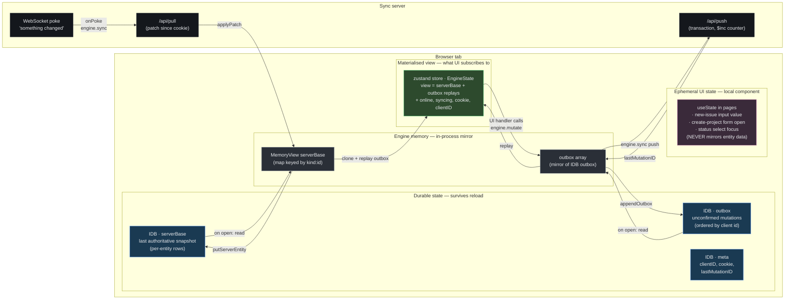
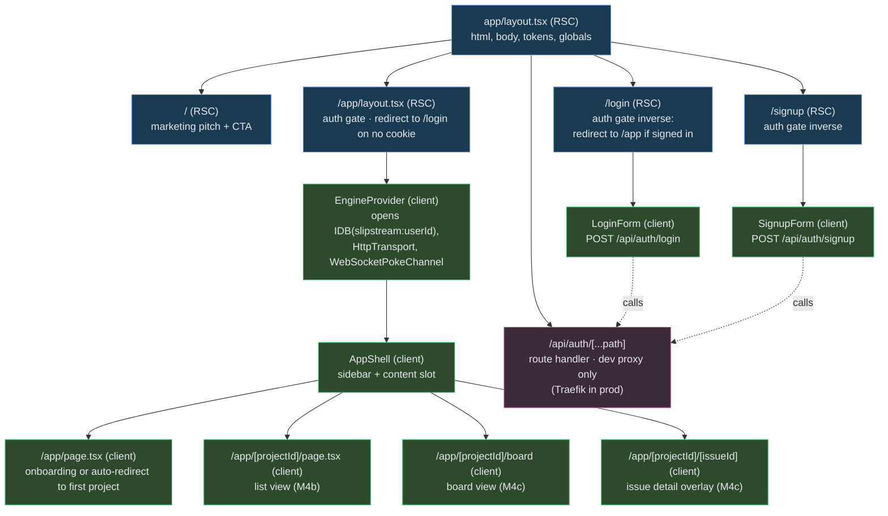
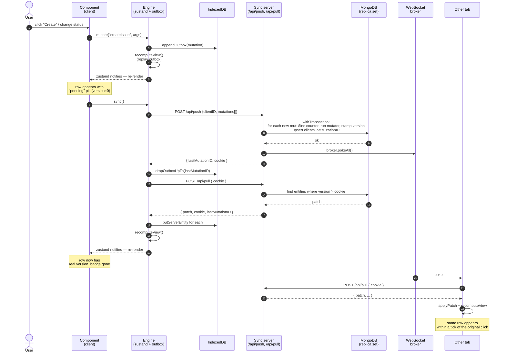
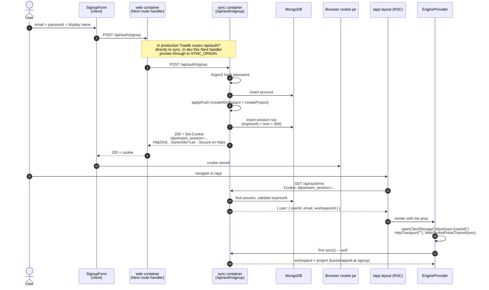
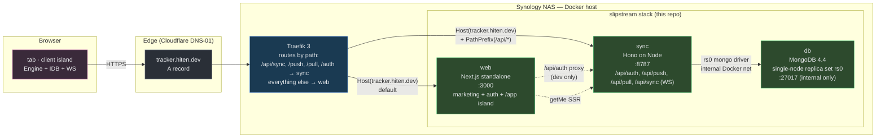

# Slipstream — Frontend Design

> Companion to `docs/ARCHITECTURE.md`. That document covers the protocol and
> the server; this one covers everything from the user's browser inward.

This is the written design for the web app: the route tree, the state model,
the boundary between RSC and the client island, the auth flow, how the engine
reaches the components, the accessibility plan, and the open questions.

The diagrams in §0 are the canonical record — the prose that follows expands
on each of them. If a diagram and the prose disagree, the diagram wins and the
prose is the bug.

---

## 0. At a glance

Five diagrams, each answering one specific question. Mermaid renders natively
on GitHub.

### 0.1 State layers — where state lives and what triggers each layer



**Invariants the diagram makes visible**:

1. There are exactly **four layers of state**: durable IDB, engine in-memory
   mirror, materialised view (computed), and ephemeral UI scratch.
2. Entity data **never** lives in `useState`. That layer is for input strings
   and "is this modal open" only.
3. There are exactly **two writers**: `engine.mutate` (appends to outbox) and
   `engine.applyPatch` (advances serverBase). Nothing else touches state.
4. The materialised view is a **computed** layer — not stored — so it can
   never drift from the inputs.

### 0.2 Route tree and the RSC ↔ client island boundary



**Invariant**: nothing under `/app` is server-rendered with synced data. The
RSC layout's only job is the cookie check. Everything inside `EngineProvider`
is computed from the materialised view, in the browser.

### 0.3 Mutation lifecycle — what happens between a user click and another tab seeing the change



### 0.4 Auth flow



### 0.5 Container view



---

## 1. Goals (frontend-specific)

The brief's first principles — local-first, optimistic, offline-capable,
accessible by default — set the frontend goals directly:

1. **Instant.** Every user action takes effect locally before the server is
   consulted. A round-trip never blocks the UI.
2. **One source of truth.** Components read from a single materialised view
   (`serverBase + unconfirmedOutbox`) rather than fetching ad-hoc. There is no
   second cache that can drift.
3. **Accessible by default.** Keyboard operability and screen-reader awareness
   of the sync lifecycle ship with each component, not as a final pass.
4. **Cheap to add a view.** Board, list, palette, detail panel are all the
   same data viewed differently; adding "ordered by priority" or
   "grouped by assignee" should be a selector, not a backend change.

## 2. Tech stack

| Layer | Choice |
| --- | --- |
| Framework | Next.js 15.1 (App Router). Upgrading to 16 with Cache Components + React Compiler in M4d/M5. |
| Runtime | React 19. |
| State | The `@slipstream/client` Engine, exposed via `EngineProvider` + `useEngine()` + `useEngineState(selector)`. The Engine wraps a Zustand vanilla store and an IndexedDB-backed outbox. |
| Styling | Design tokens (CSS custom properties from `@slipstream/ui/tokens.css`) + CSS Modules + cascade layers. No hardcoded colours or spacing. |
| Routing | App Router file conventions. Marketing/auth are RSC; the authenticated app is a single client island that boots the engine. |
| Forms | Plain client components calling `fetch('/api/auth/*')` and `engine.mutate(...)`. Server Actions later if it earns its keep. |
| Lint | `next/core-web-vitals` + a future `eslint-plugin-jsx-a11y` pass (M5). |

## 3. Route tree

```
/                       RSC — marketing + pitch + CTA (signup/login or "open app")
/login                  RSC — redirects to /app if already authed; renders <LoginForm /> (client)
/signup                 RSC — redirects to /app if already authed; renders <SignupForm /> (client)
/app                    RSC layout wraps an AuthGate + EngineProvider + AppShell
  /app                  client — picks first project, redirects to /app/[projectId]
  /app/[projectId]      client — list view of issues
  /app/[projectId]/board client — board view (M4c)
  /app/[projectId]/[issueId] client — issue detail panel (M4c, modal-style overlay)
/api/auth/[...path]     Next route handler — proxies to the sync server's /api/auth/*
                        (only used by `next dev`; in production Traefik routes
                        /api/auth straight to the sync container)
```

**Hard rule**: nothing under `/app` is server-rendered with synced data. The
RSC layout's only job is the auth gate. Once it succeeds, the engine boots in
the browser and everything inside is computed from the materialised view.

Why: RSC over a local-first engine is the wrong shape. Server-rendering an
issue list means the server has to query the database for the same data the
engine is about to materialise client-side from IndexedDB — two sources, two
opportunities to disagree, no real benefit. The marketing page and the auth
flow stay RSC because they have no synced data to disagree about.

## 4. Auth flow

```
                  ┌─────────────────┐
                  │   /signup form  │ (client island)
                  └────────┬────────┘
                           │ POST /api/auth/signup
                           ▼
                  ┌─────────────────┐
                  │ Next route hand-│ (only on next dev; Traefik in prod)
                  │ ler proxies     │
                  └────────┬────────┘
                           ▼
                  ┌─────────────────┐
                  │ apps/sync/auth  │ — Argon2 hash, write account, push
                  │                 │   createWorkspace+createProject through
                  │                 │   the normal push path, mint session
                  │                 │   token, return Set-Cookie
                  └────────┬────────┘
                           ▼ cookie set by the browser
                  ┌─────────────────┐
                  │ /app layout RSC │ — getMe() reads cookie, calls /me on
                  │                 │   sync, redirects to /login if absent
                  └────────┬────────┘
                           ▼
                  ┌─────────────────┐
                  │ EngineProvider  │ — opens IndexedDB(slipstream:userId),
                  │                 │   wires HttpTransport + WS, syncs.
                  └─────────────────┘
```

- Sessions: opaque 32-byte hex token in an `httpOnly`, `SameSite=Lax` cookie,
  `Secure` auto-flagged on HTTPS, 30-day TTL with a Mongo TTL index that
  prunes expired rows.
- Passwords: Argon2 via `@node-rs/argon2` (native bindings — fast on the
  homelab arm64 and on amd64 CI).
- Logout: `DELETE` the session row, clear the cookie, hard-redirect to
  `/login` so the engine tears down and IndexedDB stops accepting writes for
  that user.
- IDB namespacing: each user gets their own database
  (`slipstream:${userId}`), so a sign-out followed by another account on the
  same machine doesn't cross the streams.

## 5. State model

The engine's materialised view *is* the application state. Components either:

- read entities by `(kind, id)` via `engine.get(kind, id)` (the helper on the
  engine), or
- read a slice of the store via `useEngineState((s) => s.online)` etc., or
- iterate `view.entities.values()` for list/board views, filtering and
  sorting in-memory (cheap — the entire workspace fits comfortably).

Components never write to state directly. UI handlers call
`engine.mutate(name, args)`, which:

1. Appends the mutation to the IndexedDB outbox.
2. Recomputes the view (replay over `serverBase`).
3. Returns immediately. The handler then calls `engine.sync()` to push.

```
UI handler
   │ mutate(name, args)
   ▼
Engine.mutate ──▶ storage.appendOutbox ──▶ recomputeView ──▶ zustand.setState
                                                                 │
                                                                 ▼
                                                       components re-render
   │ sync()
   ▼
Engine.sync ──▶ transport.push ──▶ server stamps version ──▶
                                                  │
                                                  ▼
                              transport.pull ──▶ applyPatch ──▶
                                                       │
                                                       ▼
                              outbox.dropConfirmed ──▶ recomputeView ──▶
                                                                 │
                                                                 ▼
                                                       components re-render
                                                       with confirmed version
```

UI signal of where each row is in this lifecycle: `version === 0` means
optimistic (server hasn't ack'd). The list view renders these with a pulsing
border + "pending" pill. Once the server stamps a real version (>= 1) on the
next pull, the optimistic row is replaced with the authoritative one and the
indicator disappears. Rollback is free: a rejected mutation simply disappears
from the outbox; the next `recomputeView` lacks its effect.

## 6. Component layering

```
app/layout.tsx (RSC, root)
  ├─ app/page.tsx (RSC, marketing)
  ├─ app/login/page.tsx (RSC) ── login-form.tsx (client island)
  ├─ app/signup/page.tsx (RSC) ── signup-form.tsx (client island)
  └─ app/app/layout.tsx (RSC, auth gate)
       └─ EngineProvider (client)
            └─ AppShell (client) — sidebar + content
                 ├─ /app/page.tsx (client) — onboarding / auto-redirect
                 ├─ /app/[projectId]/page.tsx (client) — list view
                 ├─ /app/[projectId]/board (client) — board view (M4c)
                 └─ /app/[projectId]/[issueId] (client) — detail panel (M4c)
```

- **Shell**: sidebar lists projects from the view, footer carries the sync
  badge and sign-out. The sidebar is always mounted so navigating doesn't
  re-boot the engine.
- **Sync badge**: `aria-live="polite"`, the live region announcing "syncing",
  "synced (v42)", "offline" as state changes. This is the optimistic-to-
  confirmed lifecycle made perceivable for AT users.
- **Optimistic markers**: per-row indicator on `version === 0` issues. The
  status select still works on these (replays through the outbox).

## 7. Accessibility plan

Treated as a definition-of-done property, not a phase. Per-component contract:

- **Keyboard**: every action reachable; visible focus ring from tokens; logical
  tab order; modal focus traps that Escape closes (issue detail in M4c, palette
  in M4d).
- **Roving tabindex** on board columns and cards (M5).
- **Board drag-and-drop**: dnd-kit's keyboard sensor — Space to grab, Arrow to
  move, Space to drop, Escape to cancel, with `aria-live` announcements
  ("Grabbed Issue X", "In Progress, position 2", "Dropped"). M5.
- **Command palette**: WAI-ARIA combobox pattern with `role="combobox"`,
  `aria-expanded`, `aria-activedescendant`. M4d.
- **Sync state**: polite live region announcing connection state and per-tab
  updates ("Issue Y updated by Alex"). The lifecycle of every mutation is
  perceivable. M4d.
- **Reduced motion** (`prefers-reduced-motion`) and **forced colors**
  (`forced-colors`) supported from M4b onward.
- **Tests**: axe-core asserts zero violations per component; Playwright covers
  keyboard-only flows; `eslint-plugin-jsx-a11y` in lint. NVDA + VoiceOver pass
  on each release. M5.

## 8. Styling system

Design tokens live in `@slipstream/ui/tokens.css` and are exposed as CSS custom
properties under `:root`. CSS Modules consume them with no hardcoded values:

```css
.row {
  padding: var(--space-3) var(--space-4);
  border-radius: var(--radius-sm);
  background: var(--color-surface);
  color: var(--color-text);
}
```

Cascade layers: `@layer reset, tokens, base, components, utilities` — keeps
the precedence story explicit so a future Tailwind v4 swap stays a one-line
flip. Dark mode comes from `color-scheme: dark light` + tokens defined for
both via `@media (prefers-color-scheme)`.

The CSS Module rule about local-only selectors means global element styles
(like `code { … }`) are scoped via `.panel :global(code)` or moved to a
`globals.css` `@layer base` block.

## 9. Performance plan

The brief calls out two performance moments:

- **Activity-preserved view switching** (M4d/M6): use React's `<Activity>`
  to keep board and list mounted-but-hidden when switching, preserving scroll,
  filters, selection.
- **Virtualised list** for projects with thousands of issues (M6). Until then,
  the in-memory iteration over `view.entities.values()` is fine.

`useEffectEvent` for WS and presence subscriptions so they read the latest
state without tearing down on unrelated changes — the React 19.2 textbook
example.

## 10. Open questions / future work

- **Workspace permissions**: M4-as-shipped scopes pull to the entire
  workspace. Memberships exist as an entity but aren't enforced. Wiring this
  needs careful protocol thought: the server should pull only what a user's
  memberships entitle them to.
- **Multiple workspaces per user**: out of MVP scope; the data model already
  supports it via the Membership entity.
- **Issue detail navigation**: stays an overlay (M4c) or a route
  (`/app/[projectId]/[issueId]`)? Overlay is faster, route is shareable. We
  pick "overlay that pushes a route" so both work.
- **Filters as URL state**: M4c stores filter state in local component state.
  M4d / M6 will lift it into URL query params so shares and back-button work.
- **Server-side data fetching for the marketing page** (e.g. workspace count
  for social proof): stays out of scope. The repo is the marketing.
- **CSP / security headers** at the web container level: the existing Traefik
  pipeline adds `security-headers@file` which is enough for M4. Tightening
  the CSP for the client island lands with M5.
- **Service worker for true offline**: the engine already opens instantly
  offline because IDB is the source of truth, but the *shell* (HTML/JS/CSS)
  still needs a network for the first hit. M6 will add a tiny SW that caches
  the shell.

## 11. Milestone slot-in

M4 splits into four reviewable PRs:

- **M4a (shipped)** — auth, app gate, EngineProvider, "you're in" page.
- **M4b (open)** — sidebar shell, list view, create issue, status, delete.
- **M4c (next)** — board view, issue detail panel, comments, labels, filters.
- **M4d (after)** — command palette, sync-status live region, the M3-era
  socket badge made perceivable.

M5 adds the accessibility hardening from §7. M6 adds presence,
`<Activity>`-preserved view switching, virtualisation, the service worker,
and the front-door README polish.
